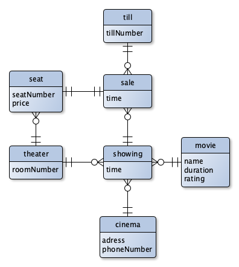

# ERD04 - Cinema

## Entities

- cinema
- theater
- seat
- movie
- sale
- till
- showing

## Attributes

### cinema
- adress
- phoneNumber

### theaters
- roomNumber

### seat
- seatNumber
- price

### movie
- name
- duration
- rating

### sale
- time

### showing
- time

## Relations

|entity1|entity2|relation|
|:-:|:-:|:-:|
|till|sale|till has zero or many sales|
|sale|till|sale has one till|
|sale|seat|sale has one seat|
|sale|showing|sale has exact one showing|
|seat|sale|seat has exact one sale|
|seat|theater|seat has one theater|
|showing|sale|showing has zero or many sales|
|showing|movie|showing has exact one movie|
|showing|cinema|showing has exact one cinema|
|showing|theater|showing has one or many theaters|
|theater|showing|theater has many showings|
|theater|seat|theater has zero or many seats|
|movie|showing|movie has zero or many showing|
|cinema|showing|cinema has 1 or many showings|

## Cardinalities
|entity1|entity2|relation|
|:-:|:-:|:-:|
|till|sale|mc:1|
|sale|seat|1:1|
|sale|shwoing|1:mc|
|seat|theater|1:mc|
|showing|movie|1:mc|
|showing|cinema|1:m|
|showing|theater|m:m|

## ERD Diagramm

